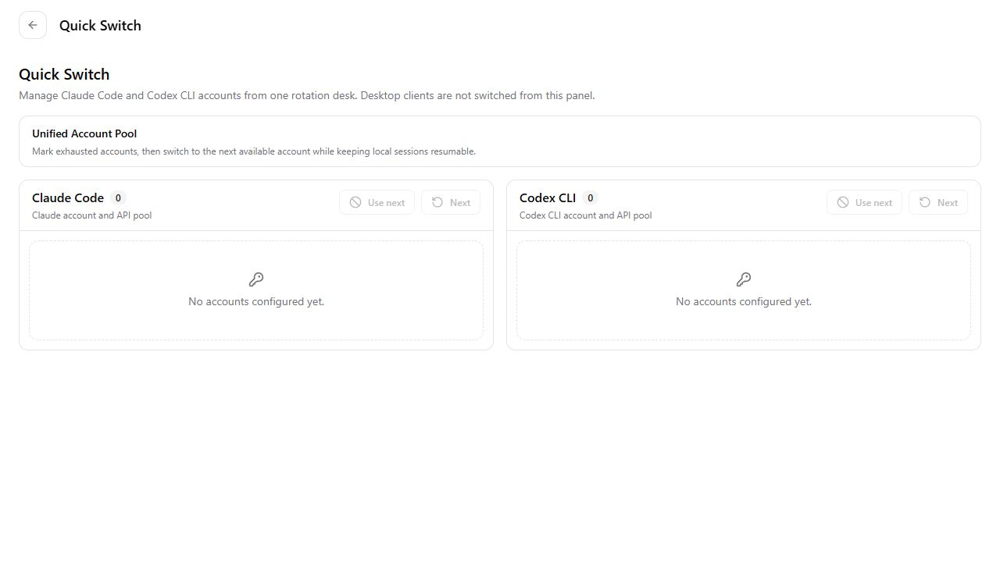
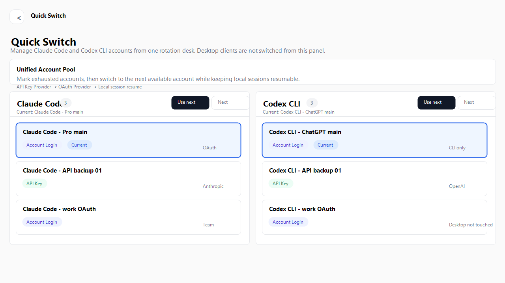
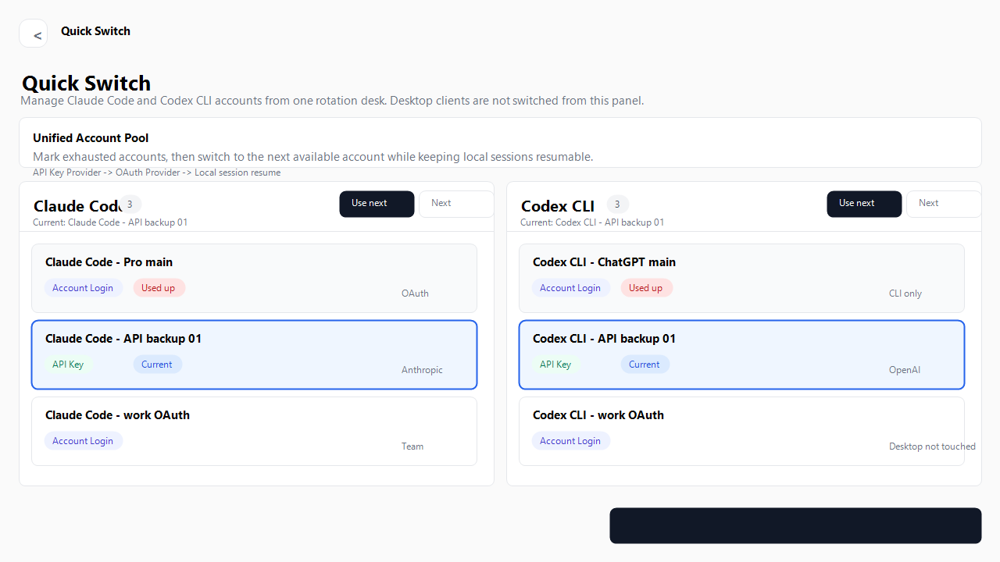

# Quick Switch 统一账号池安装与启动指南

本文档面向想从 GitHub 分支安装、运行并体验 Quick Switch 统一账号池的用户。Quick Switch 用来统一管理 Claude Code 和 Codex CLI 的多账号 Provider，支持 API Key 与账号登录混排，并提供一键切到下一个可用账号。

## 功能截图

### 首次打开，没有配置账号



### 配置多个 API Key 和账号登录 Provider 后



### 当前账号用完后切到下一个可用账号



## 支持范围

| 目标           | 支持情况               | 说明                                                       |
| -------------- | ---------------------- | ---------------------------------------------------------- |
| Claude Code    | 支持                   | 可切换 API Key Provider 与账号登录 Provider                |
| Codex CLI      | 支持                   | 可切换 API Key Provider 与 ChatGPT / OAuth 登录类 Provider |
| Claude Desktop | 不由 Quick Switch 切换 | Claude Desktop 使用独立 3P profile 管理                    |
| Codex Desktop  | 不由 Quick Switch 切换 | 桌面端登录态不直接改写，避免破坏 session                   |

Quick Switch 是 CLI 账号池，不是桌面端登录态破解器。它会调用 CC Switch 原有 Provider 切换逻辑，写入 Claude Code / Codex CLI 需要的本地配置文件。

## 从你的 GitHub 仓库安装

当前功能分支已经上传到：

```text
https://github.com/Iroha-P/cc-switch/tree/codex/quick-switch-account-pool
```

如果你还没有克隆仓库：

```powershell
cd F:\project\agent
git clone https://github.com/Iroha-P/cc-switch.git
cd cc-switch
git switch codex/quick-switch-account-pool
```

如果你已经有本地仓库：

```powershell
cd F:\project\agent\cc-switch
git remote add iroha https://github.com/Iroha-P/cc-switch.git
git fetch iroha
git switch codex/quick-switch-account-pool
```

如果 `iroha` 这个 remote 已经存在，就改用：

```powershell
git fetch iroha
git switch codex/quick-switch-account-pool
```

如果你的网络不能直连 GitHub，但当前环境可以访问 `gh-proxy.com`，可以把 remote 改成：

```powershell
git remote set-url iroha https://gh-proxy.com/https://github.com/Iroha-P/cc-switch.git
git fetch iroha
git switch codex/quick-switch-account-pool
```

## 环境依赖

### 必需依赖

| 依赖                          | 用途                         |
| ----------------------------- | ---------------------------- |
| Node.js                       | 运行 Vite / 前端构建         |
| pnpm                          | 安装前端依赖和运行脚本       |
| Rust + Cargo                  | 编译 Tauri 后端              |
| Visual Studio Build Tools C++ | Windows 上提供 `link.exe`    |
| WebView2 Runtime              | Windows 上运行 Tauri WebView |

### 检查命令

```powershell
node -v
pnpm -v
cargo --version
rustc --version
```

如果 `cargo --version` 报错，说明 Rust 没装好。

如果编译时报 `link.exe not found`，说明 Visual Studio C++ Build Tools 没装好。

## Windows 安装依赖

### 1. 安装 Node.js

推荐安装 Node.js LTS。安装后重新打开 PowerShell：

```powershell
node -v
```

### 2. 安装 pnpm

```powershell
corepack enable
corepack prepare pnpm@latest --activate
pnpm -v
```

如果 `corepack` 不可用，也可以：

```powershell
npm install -g pnpm
```

### 3. 安装 Rust

打开：

```text
https://rustup.rs/
```

安装完成后重新打开 PowerShell：

```powershell
cargo --version
rustc --version
```

### 4. 安装 Visual Studio Build Tools

打开：

```text
https://visualstudio.microsoft.com/visual-cpp-build-tools/
```

安装时勾选：

```text
Desktop development with C++
```

至少需要包含：

- MSVC v143 或更新版本
- Windows 10 / Windows 11 SDK
- C++ CMake tools for Windows

装完后重新打开 PowerShell，再运行：

```powershell
where link
```

能找到 `link.exe` 后，Tauri 编译才会通过。

### 5. 安装 WebView2 Runtime

多数 Windows 11 已经自带。如果缺失，安装：

```text
https://developer.microsoft.com/microsoft-edge/webview2/
```

## 安装项目依赖

在项目目录执行：

```powershell
cd F:\project\agent\cc-switch
pnpm install
```

如果你之前已经装过依赖，也可以直接继续。

## 启动开发版

完整 Tauri 开发模式：

```powershell
pnpm dev
```

正常情况下会看到：

```text
VITE ready
Running DevCommand (`cargo run ...`)
```

随后会打开 CC Switch 桌面窗口。

如果只想预览前端页面，不启动 Tauri 后端：

```powershell
pnpm dev:renderer --host 127.0.0.1
```

然后打开：

```text
http://127.0.0.1:3000/
```

注意：只跑 renderer 时，部分需要 Tauri 后端的真实数据可能为空，适合检查 UI，不适合测试真实切换。

## 构建安装包

```powershell
pnpm build
```

Tauri 会编译前端和 Rust 后端，并在 `src-tauri/target/release/bundle` 下生成安装产物。具体子目录取决于平台和打包格式。

## 配置不同账号

Quick Switch 不直接创建账号，它读取的是 CC Switch 里的 Provider。

推荐流程：

1. 打开 Claude 面板，添加所有 Claude Code Provider。
2. 打开 Codex 面板，添加所有 Codex CLI Provider。
3. 每个账号添加成一个 Provider。
4. API Key 账号填写 API Key、Base URL、模型。
5. 账号登录或 OAuth 类型按界面提示完成授权。
6. 给 Provider 起清楚的名字。
7. 回到 Quick Switch 页面统一切换。

推荐命名：

```text
Claude Code - Pro main
Claude Code - API backup 01
Claude Code - work OAuth
Codex CLI - ChatGPT main
Codex CLI - API backup 01
Codex CLI - work OAuth
```

更完整的账号配置教程见：

```text
docs/quick-switch-account-pool-zh.md
```

## 使用 Quick Switch

1. 打开 CC Switch。
2. 点击顶部工具栏的 Quick Switch 图标。
3. 在 Claude Code 或 Codex CLI 账号池中查看当前账号。
4. 当前账号用完后点击 `Use next`。
5. 只是想跳到下一个账号时点击 `Next`。
6. 不想参与轮换的账号可以标记为 `Used up`。
7. 额度恢复后，把账号标回 `Available`。

`Use next` 会做三件事：

1. 把当前账号标为 Used up。
2. 切到下一个 Available Provider。
3. 优先打开最近本地会话的恢复终端。

## 常见报错处理

### cargo metadata: program not found

原因：没有安装 Rust / Cargo，或安装后没有重开终端。

处理：

```powershell
cargo --version
```

如果命令不存在，安装 Rust 后重新打开 PowerShell。

### failed to download config.json

原因：Cargo 下载 crates.io 依赖失败，常见于代理配置指向了不可用端口。

处理：

```powershell
git config --global --get http.proxy
git config --global --get https.proxy
```

如果看到类似 `127.0.0.1:7890`，但本机代理没开，可以清掉：

```powershell
git config --global --unset http.proxy
git config --global --unset https.proxy
```

如果你必须走代理，请确认代理软件已启动，并且端口正确。

### linker link.exe not found

原因：Windows 上没有安装 Visual Studio C++ Build Tools。

处理：安装 `Desktop development with C++` 工作负载，然后重新打开 PowerShell。

检查：

```powershell
where link
```

### Codex CLI 切换后旧终端没变

Codex CLI 通常启动时读取配置，旧终端不会自动刷新。请使用 Quick Switch 打开的新终端，或手动关闭旧终端后重新启动 Codex CLI。

### Quick Switch 里没有账号

检查：

1. 是否已经在 Claude / Codex 面板添加 Provider。
2. Provider 是否属于 Claude Code 或 Codex CLI。
3. 是否只启动了 renderer，导致没有真实 Tauri 后端数据。
4. 原 Provider 页面是否能正常加载账号列表。

## 验证命令

开发或修改后建议运行：

```powershell
pnpm typecheck
pnpm vitest run tests/components/QuickSwitchManager.test.tsx
pnpm vitest run tests/integration/App.test.tsx --testTimeout 15000
pnpm prettier --check src/App.tsx src/components/quick-switch/QuickSwitchManager.tsx tests/components/QuickSwitchManager.test.tsx docs/quick-switch-account-pool-zh.md docs/quick-switch-install-guide-zh.md
```

集成测试里如果出现 Tauri window metadata 的 stderr，但最终 `Test Files` 和 `Tests` 都是 passed，就说明测试通过。
